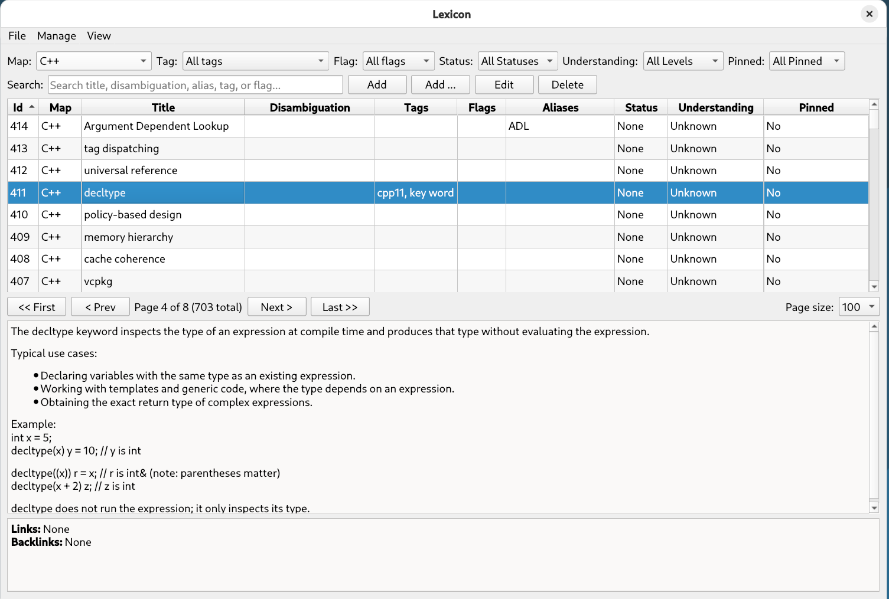
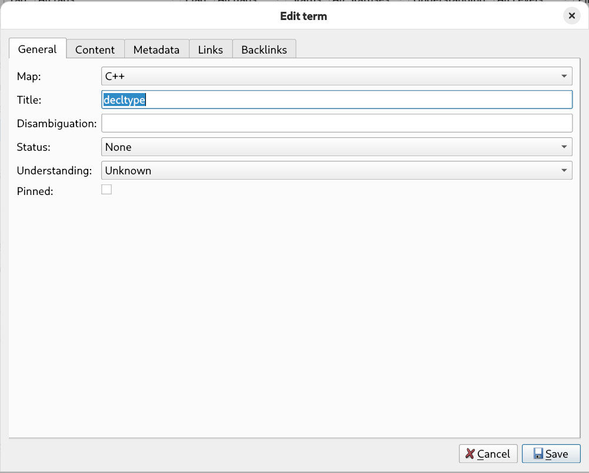
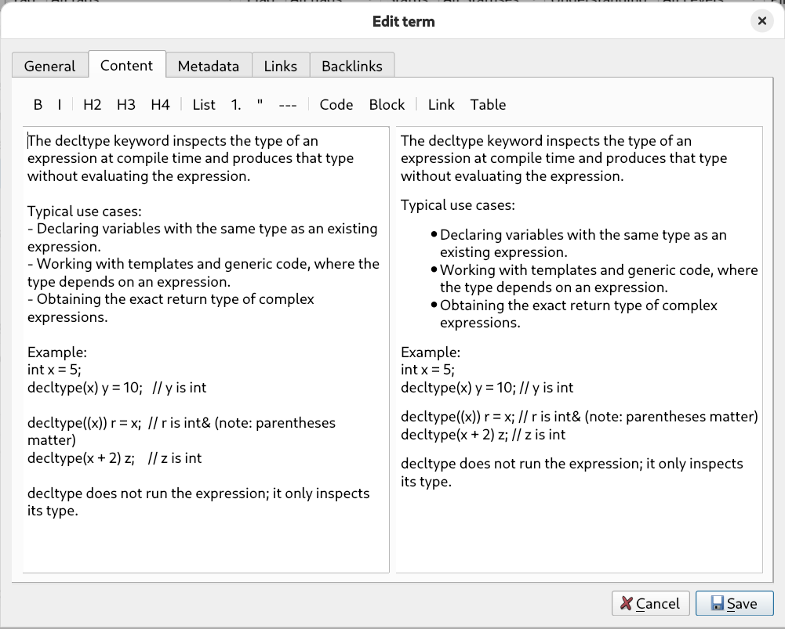
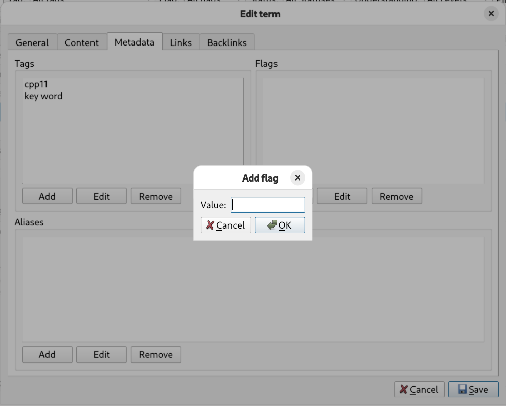
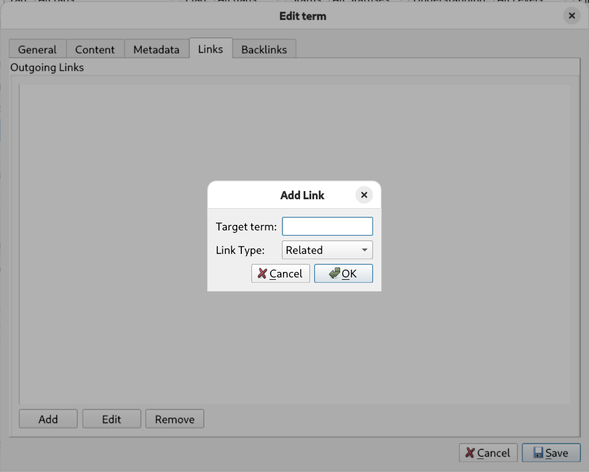
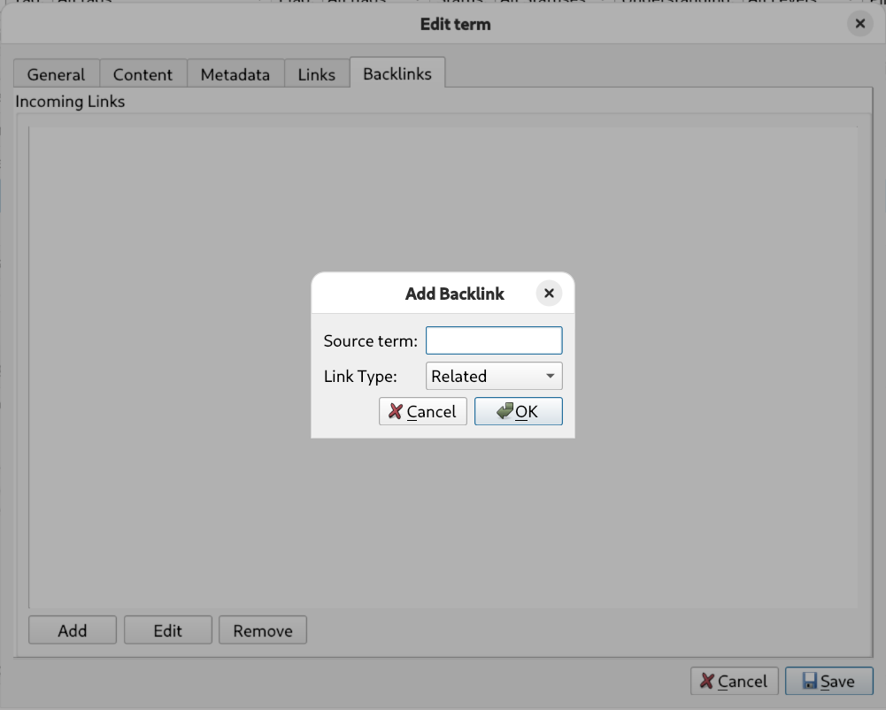

# Lexicon


Lexicon is a desktop knowledge dictionary built with Qt Widgets and SQLite.
It is designed for structured learning and technical note-taking with maps, terms, metadata, and typed links between concepts.

## Table of contents

- [Highlights](#highlights)
- [Screenshots](#screenshots)
- [Requirements](#requirements)
- [Build and run](#build-and-run)
- [Extensive user manual](#extensive-user-manual)
- [Database model](#database-model)
- [Data location and backup](#data-location-and-backup)
- [Troubleshooting](#troubleshooting)
- [Recent updates](#recent-updates)
- [Roadmap](#roadmap)
- [License](#license)

## Highlights

- SQLite-backed local dictionary (single-file DB)
- Full CRUD for maps and terms
- Rich term metadata:
  - aliases
  - tags
  - flags
  - status
  - understanding level
  - pinned state
- Typed term relationships:
  - outgoing links
  - incoming links (backlinks)
  - link types like `Is A`, `Part Of`, `Depends On`, `Related`, etc.
- Markdown term content editor with formatting toolbar and live preview
- Global read-only overviews for all tags, flags, and aliases
- Fast filtering and search:
  - search in title, disambiguation, alias, tag, and flag
  - filters for map, tag, flag, status, understanding, pinned
- Pagination for large datasets
- Column sorting in the term table
- Theme switch: light mode and dark mode

## Screenshots

### Main window



The main screen combines filters, searchable term table, pagination, rendered Markdown content, and link/backlink preview.

### Term editor — General tab



Basic identity and state fields for a term: map, title, disambiguation, status, understanding, and pinned flag.

### Term editor — Content tab



Markdown editor on the left, live rendered preview on the right, plus a formatting toolbar.

### Term editor — Metadata tab



Manage tags, flags, and aliases with dedicated add/edit/remove controls.

### Term editor — Links tab



Create and maintain outgoing relationships to other terms.

### Term editor — Backlinks tab



Create and maintain incoming relationships (who references this term).

## Requirements

- CMake `3.21+`
- C++23-compatible compiler (GCC/Clang/MSVC)
- Qt 6 with:
  - `Widgets`
  - `Sql`
- SQLite Qt driver (usually included with Qt packages)

### Debian/Ubuntu example

```bash
sudo apt update
sudo apt install -y build-essential cmake qt6-base-dev libqt6sql6-sqlite
```

## Build and run

```bash
cmake -S . -B build -DCMAKE_BUILD_TYPE=Release
cmake --build build --target Lexicon -j
./build/Lexicon
```

## Extensive user manual

### 1) First launch

1. Start the app.
2. Lexicon creates/opens `lexicon.db` automatically in the executable directory.
3. Database migrations are applied automatically on startup.

### 2) Create and manage maps

Maps are top-level buckets for terms (for example: `C++`, `Databases`, `Networking`).

1. Open `Manage` → `Maps...`.
2. Use:
   - `Add` to create a new map
   - `Edit` to rename/change description
   - `Delete` to remove a map
3. Important: deleting a map also deletes all terms in that map (cascade delete).

### 3) Explore terms in the main window

At the top you can combine search and filters:

- `Map`
- `Tag`
- `Flag`
- `Status`
- `Understanding`
- `Pinned`
- free-text `Search`

Search matches these fields:

- title
- disambiguation
- aliases
- tags
- flags

The central table supports:

- row selection to show content/details below
- double click to edit a term
- sorting by clicking column headers

### 4) Pagination and large dictionaries

Lexicon is optimized for larger datasets with paging controls:

- `<< First`
- `< Prev`
- `Next >`
- `Last >>`
- `Page size` selector

Use these controls to browse large lexicons without loading everything into one visible page.

### 5) Create a new term

You have two add options in the main toolbar:

- `Add`: quick add path; title is prefilled from current search text
- `Add ...`: full add dialog path

Recommended workflow:

1. Select the target map.
2. Click `Add` or `Add ...`.
3. Fill the General tab:
   - `Title` (required)
   - optional `Disambiguation` (useful for same title in one map)
   - `Status` (`None`, `Draft`, `Completed`)
   - `Understanding` (`Unknown` → `Mastered`)
   - `Pinned`
4. Fill other tabs as needed.
5. Click `Save`.

### 6) Edit term content with Markdown

Open a term and go to the `Content` tab.

- Left pane: raw Markdown text
- Right pane: rendered preview
- Top toolbar shortcuts:
  - bold, italic
  - H2/H3/H4 headings
  - lists and quote
  - horizontal rule
  - inline code and code block
  - link and table insertion

The preview updates automatically as you type.

### 7) Maintain metadata (tags, flags, aliases)

In `Metadata` tab:

- `Tags`: classification labels (topics, versions, domains)
- `Flags`: custom markers (priority/state markers)
- `Aliases`: alternate names and synonyms

Each list supports `Add`, `Edit`, `Remove`.

Tips:

- Keep tags consistent (e.g., `cpp20`, `templates`, `concurrency`)
- Use aliases for alternate spellings and abbreviations
- Use flags for operational workflows (e.g., `review`, `needs-example`)

### 8) Create links and backlinks

Use `Links` and `Backlinks` tabs in the term editor.

- `Links`: create outgoing relationship from current term to a target term
- `Backlinks`: create incoming relationship from a source term to current term

Available relation types include:

- `Is A`
- `Part Of`
- `Uses`
- `Depends On`
- `Implements`
- `Related`
- `Contrasts`
- `Alternative To`
- `Parent Of`

These relationships help build a concept graph and improve navigation context.

### 9) Read content and relationship context

When you select a term in the main table:

- the lower content pane renders the term’s Markdown as HTML
- links/backlinks summary is shown below the content

This gives quick context while browsing without opening the edit dialog every time.

### 10) Global overviews and themes

From the menu:

- `View` → `All tags...`
- `View` → `All flags...`
- `View` → `All aliases...`

Use these to inspect normalized values and usage counts.

Appearance:

- `View` → `Light mode`
- `View` → `Dark mode`

Theme preference is persisted between sessions.

### 11) Editing and deletion safety notes

- Deleting a term removes its aliases/tags/flags and related links due to cascade rules.
- Deleting a map removes all contained terms.
- Keep regular backups if your lexicon is mission-critical.

## Database model

Lexicon initializes and migrates schema automatically.

Core tables:

- `map`
- `term`
- `alias`
- `tag`
- `flag`
- `link`
- `log`

Design notes:

- Foreign keys enabled
- Cascade delete used for dependent records
- Unique constraints for map names and per-term value deduplication

## Data location and backup

- Default DB file: `lexicon.db`
- Location: next to the executable binary

Backup strategies:

1. Close Lexicon.
2. Copy `lexicon.db` to safe storage.
3. Optionally version backups (daily/weekly snapshots).

## Troubleshooting

### App does not start (Qt plugin/driver issue)

- Verify Qt runtime installation.
- Ensure SQLite Qt SQL driver is installed.

### Database errors on startup

- Check write permissions for the executable directory.
- Ensure `lexicon.db` is not locked by another process.

### Build fails

- Confirm C++23 compiler support.
- Confirm `Qt6::Widgets` and `Qt6::Sql` are discoverable by CMake.

## Recent updates

- term table supports sorting by clicking column headers
- `New term` now prefills `Title` from current `Search` text

## Roadmap

- export to CSV/JSON
- add new unique indexes
- export to static HTML
- HTTP server
- improve search ranking so exact match appears first

## License

This project is licensed under the MIT License. See [LICENSE](LICENSE).