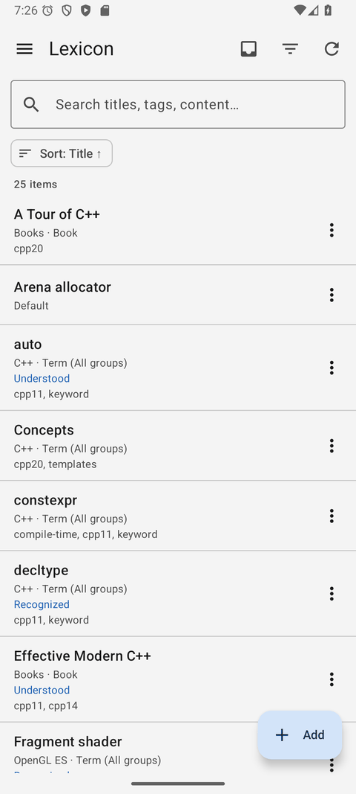
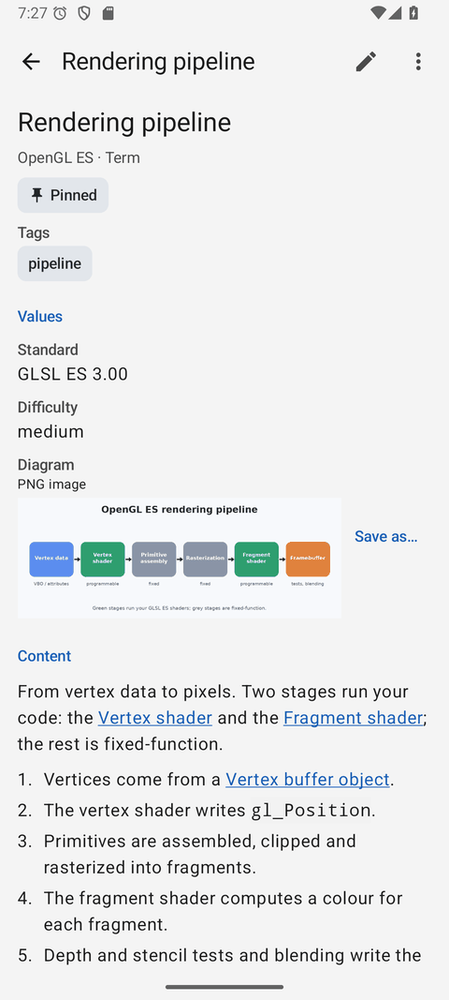
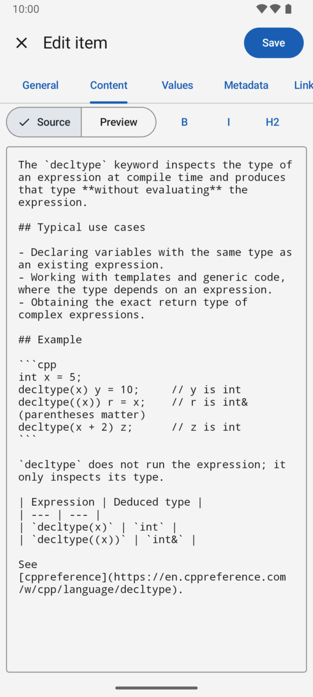
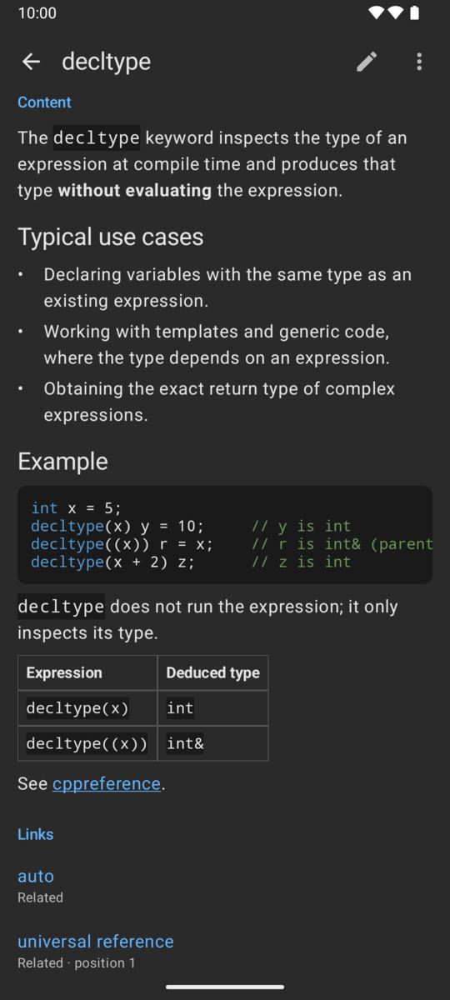
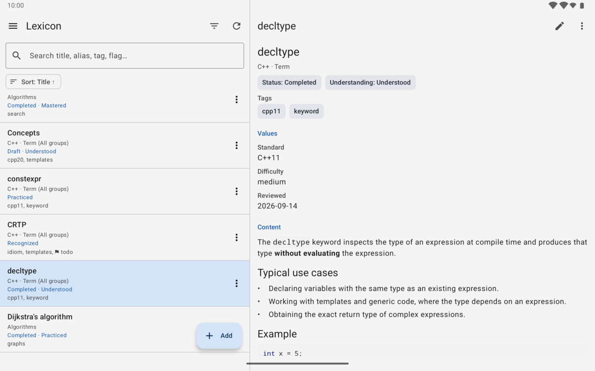

# Lexicon for Android

A native Android client for Lexicon, written in Kotlin with Jetpack Compose. It
talks to `LexiconServer` over the versioned REST API (`/api/v1`) and nothing
else.

**The Android client contains no Lexicon database. LexiconServer is the source
of truth.** Groups, types, fields, items, values, metadata, links, backlinks,
blobs, cards and their counts, validation, filtering and transactions all live
on the server; the app shows them and sends back what the person changes.
There is no editable local replica. The app stores encrypted copies of
previously loaded read responses for offline browsing and queues Inbox ideas
until the server returns. Other changes still require the server.

```text
                    LexiconApplication
                           ↑
                 lexicon-storage-sqlite
                           ↑
                     LexiconServer
                           ↑
                      REST / JSON
               ┌───────────┼────────────┐
               ▼           ▼            ▼
         lexicon-web    Android     other clients
                     (this project)
```

The Qt desktop client is unchanged: it links `LexiconApplication` directly and
opens SQLite itself.

## Contents

- [Screenshots](#screenshots)
- [Toolchain](#toolchain)
- [Build](#build)
- [Run against a server](#run-against-a-server)
- [Using the app](#using-the-app)
- [Security](#security)
- [Feature parity](#feature-parity)
- [Tests](#tests)
- [Release signing](#release-signing)
- [Limitations](#limitations)
- [Source layout](#source-layout)

## Screenshots

<p>
  
  
  
  
</p>



More, next to the desktop and web clients, in the
[main README](../README.md#android-client).

## Toolchain

| | |
| --- | --- |
| Application ID and namespace | `com.robertvokac.lexicon` (the project's domain, `lexicon.robertvokac.com`, reversed) |
| `minSdk` | 26 (Android 8.0) |
| `targetSdk`, `compileSdk` | 37 (Android 17, SDK platform `android-37.0`) |
| Build tools | 36.1.0 |
| Android Gradle Plugin | 9.4.1, with its built-in Kotlin support |
| Kotlin | 2.4.20 (Compose compiler and serialization plugins of the same version) |
| Gradle | 9.7.1 through the wrapper; the distribution's SHA-256 is pinned |
| JDK | 17 or newer to run Gradle (developed with OpenJDK 21); bytecode targets Java 17 |

The current AndroidX and Compose releases require `compileSdk` 37, which is why
the build uses it. Install it with
`sdkmanager "platforms;android-37.0" "build-tools;36.1.0"` if Android Studio has
not already.

### Libraries

Every version is pinned in [`gradle/libs.versions.toml`](gradle/libs.versions.toml),
and [`gradle/verification-metadata.xml`](gradle/verification-metadata.xml) pins
the SHA-256 of every artifact Gradle resolves, so a dependency cannot change
without the build failing. After changing a version, regenerate it with:

```bash
./gradlew --write-verification-metadata sha256 help assembleDebug assembleRelease \
  assembleDebugAndroidTest testDebugUnitTest lint
```

| Purpose | Library | License |
| --- | --- | --- |
| UI | Jetpack Compose BOM 2026.09.00 (UI 1.12.1, Material 3 1.4.0, Material icons 1.7.8), Material 3 adaptive 1.3.0 | Apache-2.0 |
| Screens and state | Activity Compose 1.13.0, Lifecycle 2.11.0, Navigation Compose 2.10.1, Core KTX 1.19.0 | Apache-2.0 |
| Preferences | DataStore Preferences 1.2.1 | Apache-2.0 |
| HTTP | OkHttp 5.5.0 | Apache-2.0 |
| JSON | kotlinx.serialization 1.11.0 | Apache-2.0 |
| Coroutines | kotlinx.coroutines 1.11.0 | Apache-2.0 |
| Markdown parsing | commonmark-java 0.30.0 with the GFM tables, strikethrough and autolink extensions (autolink-java 0.12.0) | BSD-2-Clause, MIT |

Retrofit is not used: one small client class covers every endpoint. Markdown is
parsed by commonmark-java and drawn with native Compose text; see
[Markdown](#markdown).

Tests additionally use JUnit 4.13.2, Robolectric 4.17 (with the Android 15
framework jar resolved and verified by Gradle, and run offline), OkHttp's
MockWebServer and okhttp-tls 5.5.0, kotlinx-coroutines-test, and the AndroidX
Test and Compose UI test libraries.

## Build

The project is independent of the CMake build of the rest of the repository.

```bash
cd lexicon-android
./gradlew test            # JVM unit, Robolectric and Compose UI tests
./gradlew lint            # Android lint; any warning fails the build
./gradlew assembleDebug   # app/build/outputs/apk/debug/app-debug.apk
./gradlew assembleRelease # minified with R8, unsigned unless a keystore is configured
```

Release builds only reach HTTPS servers. To try the R8-shrunk code against a
local development server, `./gradlew assembleDebug -Plexicon.minifyDebug` shrinks
a debug build with the release rules.

Android Studio opens the `lexicon-android` directory as a project. The SDK
location comes from `ANDROID_HOME` or a `local.properties` file with
`sdk.dir=...`; that file is machine specific and ignored by Git.

## Run against a server

### Emulator and a server on the development machine

Start a server on your machine as [`docs/server.md`](../docs/server.md)
describes:

```bash
LexiconServer auth set-user --database ~/lexicon/lexicon.db
LexiconServer --database ~/lexicon/lexicon.db     # 127.0.0.1:8628
```

The Android emulator reaches the machine's loopback address as `10.0.2.2`. A
**debug** build proposes `http://10.0.2.2:8628` on its login screen and accepts
plain HTTP to these development hosts without another step: `10.0.2.2`,
`10.0.3.2` (Genymotion), `localhost` and `127.0.0.1`.

```bash
./gradlew installDebug
adb shell am start -n com.robertvokac.lexicon/.MainActivity
```

A phone on USB can use the same server through `adb reverse tcp:8628 tcp:8628`
and `http://127.0.0.1:8628`.

### Phone and server on the same test network

Start the server so the phone can reach it, then enter the computer's network
address in the debug app and check **Allow HTTP for testing** on the login
screen:

```bash
LexiconServer --database ~/lexicon/lexicon.db --listen 0.0.0.0 --allow-http
# On the phone: http://192.168.1.20:8628 (use your computer's actual IP)
```

This opt-in is available only in debug builds. With it, the password and
session token travel over the network without encryption. An HTTP session
remains usable after the app restarts; signing in again to a network HTTP
address requires checking the box again. Release builds remain HTTPS-only.

### Production: HTTPS

Release builds only speak HTTPS, and trust exactly the certificates Android
trusts. Put the server behind a reverse proxy with a certificate from a public
CA, or let it terminate TLS itself; both are in
[`docs/server.md`](../docs/server.md#http-https-and-reverse-proxies):

```bash
LexiconServer --listen 0.0.0.0 --port 8443 \
  --tls-cert /etc/lexicon/fullchain.pem --tls-key /etc/lexicon/privkey.pem
```

Then sign in with `https://api.example.com:8443`, or `https://api.example.com`
behind a proxy. A path prefix such as `https://example.com/lexicon` works; a
pasted `.../api/v1` is trimmed. The app does not need `--allowed-origin`: that
is for browsers, and the app sends no `Origin` header.

A self-signed certificate is refused with a TLS error. There is no switch to
accept it; install a proper certificate instead.

## Using the app

- **Login.** Server URL, user name and password. The app first calls
  `GET /api/v1/health` and refuses a server that does not report API version 1,
  then logs in. Wrong credentials, a refused connection, a TLS failure, an
  incompatible server and too many attempts each get their own message.
  **Remember this phone** is selected by default: the server issues a separate
  one-use renewal secret so the app can replace an expired session without
  another password prompt. Uncheck it on a shared phone. A remembered phone
  expires after 90 days without renewal and can be revoked in Settings.
- **Items.** The main screen: a search field, the active filters as chips, and
  the items as a list, loaded a page at a time as you scroll. Pull down to
  refresh. Tap an item to read it; long-press, or use its ⋮ button, to edit or
  delete it.
- **Search.** Title, disambiguation, aliases, tags, flags and content, as on the
  desktop, with the server's ranking: the exact title first. The query runs on
  the server a moment after typing stops; typing on cancels the request that
  is still running.
- **Filters and sort.** The filter button opens a sheet with every filter of the
  desktop's filter row: group, type and the selected type's fields, ID, title,
  disambiguation, alias, tag, flag, status, understanding, pinned, and property
  filters, plus the sort column (including the type's fields) and direction.
  The badge counts active filters; **Clear filters** resets them.
- **Quick Add.** The **Add** button asks for a title and adds the item to the
  selected group, or the group of a selected group-scoped type, or `Default` —
  the same rule as the desktop's Add. Items already named like that anywhere
  are shown first, and nothing is added until you choose **Add anyway**.
  **More…** opens the full editor instead, the desktop's Add ….
- **Inbox.** The tray button above the list catches an idea: a title and plain
  text, saved to `Default` with the type `Inbox` - which the server creates the
  first time - whatever the filters show.
- **Offline Inbox.** An idea never waits for the network. When the server
  cannot be reached - no signal, the server or a proxy down, the session
  expired - the idea is kept on the phone and a banner above the list says how
  many wait. They go out by themselves, oldest first, when the network comes
  back, when someone signs in, and every half hour in the background, even
  with the app closed; **Send now** tries at once. An app started without the
  server offers **Save an idea for later** on its "Cannot reach the server"
  screen. An idea goes only to the server and account it was caught for. If
  the server refuses one (its title is already in `Default`), it waits with
  the reason for **Edit** or **Delete**; a save whose answer was lost on the
  way is recognised and not sent twice.
- **Item page.** Title, group and type, status, understanding, pinned, tags,
  flags, aliases, values (with **Save as…** for blobs), properties, the rendered
  Markdown content, links and backlinks. Links open the item they point to,
  and so does a `[[Title]]` in the content; one to no item offers to create it.
  Opening an item records one read (`POST /items/{id}/read`), once per opening.
  Its menu has **Relationship graph**: the items around it, drawn with the
  same layout as the other clients, one, two or three links deep. Pinch to
  zoom; tap an item, or pick it from the list under the graph, to centre on it
  or open it. The graph's **Quiz cards** button starts a card quiz over the
  items it shows: its current centre, as deep as it currently goes. The menu
  also has **Cards** and **Card quiz**.
- **Editor.** General, Content, Values, Metadata, Links and Backlinks, as tabs of
  one screen. Everything, including both link directions, is saved in one
  request, which the server commits as one unit of work. Changing the type
  asks first when field values would be lost, with their number. A failed save
  keeps everything typed and says why; leaving with unsaved changes asks first.
  The `[[ ]]` button inserts a link to an item picked from the list, and
  **Add links from content** on the Links tab adds a Related link to every item
  the content names.
  If another client saved the item after the editor opened it, the server
  refuses the save (409) and the app names what differs, then offers
  **Overwrite**, **Reload** or **Keep editing**.
- **Manage.** Groups (add, edit, delete, with the desktop's warning that the
  items go too) and types with their fields (the item and value counts come from
  the server before anything destructive happens).
- **History and Trash.** Open an item's previous versions from its page or
  deleted items from the drawer. Restoring a deleted item gives it a new ID.
- **Account.** Settings can change the password, list or revoke sessions, and
  list or revoke remembered phones.
  Changing the password signs every device out immediately.
- **Alarms.** Every alarm, the soonest first, with the date and time it goes
  off in the phone's time zone; those already gone off are marked. **+** adds
  one, a tap edits it: a title, a date and a time (typed, or chosen with the
  date and time pickers), a description, repeat days and an optional linked
  item. The server stores the time in UTC.
  An alarm that has gone off shows **Dismiss** and **Snooze 10 min** until
  someone deals with it, here or in another client.
- **Alarm notifications.** Alarms ring even when the app is closed. The app
  hands each alarm still to come to the system `AlarmManager` (at the minute
  when exact alarms are allowed, otherwise within a few minutes while the phone
  saves power) and shows a notification when it goes off, with **Dismiss** and
  **Snooze 10 min**; a swipe dismisses it too. Tapping it opens the Alarms
  screen. The dismissal goes to the server, so other clients stop ringing; one
  made offline is sent at the next sync. The app looks at the server when it
  starts, when the alarm list is opened and every half hour, schedules again
  after a restart or an update, and takes everything off the phone on sign-out.
  An expired session keeps the alarms it knows ringing. The Alarms screen asks
  for the notification permission (Android 13+) and offers the exact-alarm
  setting (Android 12+).
- **Review.** The items due now, one card at a time: the title, **Show answer**
  for the content, then **Again**, **Hard**, **Good** or **Easy**, each saying
  when the item comes back. Items rated Again return in the same sitting.
- **Cards.** An item's questions and answers for active recall, from **Cards**
  in the item page's menu: each card's question, answer, **Success** and
  **Failure** counts and **Last attempt** (in the phone's time zone, or
  *Never*). **+** adds a card and a tap edits one, both with a question and an
  answer of several lines; the trash button deletes one after asking. The
  counts are the server's and read-only: only a quiz answer moves them, and
  editing a card keeps them. The server refuses a blank question or answer,
  and the dialog says so.
- **Card quiz.** From **Card quiz** in the item page's menu or the Cards
  screen, or **Quiz cards** in the relationship graph. **This item** asks the
  item's own cards; **Neighborhood** also asks those of the items one, two or
  three links around it (two by default, as the graph starts), the item's own
  first and each card naming its item. A card shows its question and
  **Show answer**; the answer then comes with **Do you know?** and **Yes** or
  **No**. Showing the answer records nothing; Yes or No goes to the server,
  which counts it and stamps the time, and the next card follows once it has.
  Yes and No wait while an answer is on its way, so a double tap counts once;
  a failed answer stays on its card with the reason, and a card deleted
  elsewhere meanwhile is skipped. A neighbourhood larger
  than the 150 items a quiz covers says so. At the end: the cards, Yes and No
  of this sitting, which are not kept. A card quiz is not Review: it never
  changes an item's understanding or when it is due. Leaving the quiz leaves
  the unanswered cards as they are; rotating the phone keeps the place.
- **Overview.** All tags, all flags and all aliases with their usage counts.
- **Settings.** Server, session, theme (system, light, dark), page size and
  versions, and **Export…** and **Import…** of the whole dictionary as one
  file through the document picker, with or without the attached files (see
  `docs/export-format.md`).

On a large screen (840 dp and wider) the item list and the selected item sit
side by side, and the type list sits beside the selected type's fields.

### Share to Lexicon

Other apps can share text or a link to Lexicon through the Android share sheet
(`ACTION_SEND`, `text/plain`). The app opens the editor for a new item with:

- the shared subject, such as a page title, as the title;
- a shared URL as the content, written as a Markdown link (`<https://...>`);
- other shared text as the content, and its first line as the title when there
  is no subject.

Nothing is saved until you tap **Save**. After saving, or closing the editor,
you are back in the app that shared. Shared text is limited to 64,000
characters and cleaned of control characters.

### Quick Add shortcut

Long-press the launcher icon for **Quick add**, which opens the app straight
into Quick Add.

### Blobs

A Blob field is uploaded from the system document picker and saved with the
system's "create document" picker (the Storage Access Framework). The app never
asks for storage permissions and never touches file paths: the picker grants
access to the one document chosen. Uploads stream from the document with a
progress line, and the item cannot be saved until the upload has finished;
`413` from the server (`--max-blob-bytes`) is reported as such. A download that
fails or is cancelled deletes the incomplete document again.

An Image field works the same way but offers only PNG, JPEG, GIF, WebP and BMP
documents, checks the file's first bytes before uploading it, and shows the
picture: a thumbnail in the editor and on the item page, and the whole image
over the screen on a tap, with pinch to zoom. Pictures are decoded at the size
they are shown and kept in memory while it allows.

Blob maintenance — scanning, verifying and garbage collecting the blob
directory — remains a local desktop and server administration feature. The REST
API does not expose it and neither does the app.

### Markdown

Content is stored as Markdown source, edited as plain text with the desktop's
formatting toolbar (bold, italic, H2–H4, lists, quote, rule, inline code, code
block with a remembered language, link, table), and previewed natively:
commonmark-java parses GitHub-flavoured Markdown into a small immutable model
that Compose draws. There is no WebView and no HTML rendering: raw HTML in the
source is shown as text, images are shown as links rather than fetched, and a
link is followed only if its scheme is `http`, `https`, `mailto` or `tel` (the
web client's list), through a browsable `VIEW` intent. `javascript:`, `intent:`, `file:`, `content:` and every
other scheme are shown as plain text. C++ code blocks are highlighted as on the
desktop. Long notes are parsed off the main thread, the preview renders a moment
after typing stops, and the item page composes only the visible blocks.

## Security

- **Password.** Held in the login screen's text field while typed, sent once to
  `POST /auth/login`, and cleared as soon as the server answers with a session.
  It is never stored, logged or put into saved instance state. The field is a
  Material secure text field (masked, no copy) marked as a password for
  Android autofill; the user name field is marked as a user name.
- **Session and renewal tokens.** Stored in their own DataStore file, encrypted with
  AES-256-GCM under a key generated in **Android Keystore**
  (`lexicon.session.v1`, non-exportable, randomized IVs). The server URL and
  user name are bound to the ciphertext as associated data, so a token cannot be
  moved to another server by editing the file. Anything that does not decrypt —
  altered data, a restored backup, a key the system invalidated — is discarded
  and the person signs in again. If the key cannot be used at all, the session
  lasts only until the app closes; the token is never written in the clear.
- **Expired sessions.** For a remembered phone, a `401` exchanges the one-use
  renewal secret and retries the original request once. Concurrent requests
  share the renewal; a revoked or expired phone returns to the login screen.
  The screens underneath stay alive, so signing in again as the same person continues where the
  session ended, with unsaved editor text intact; signing in as someone else, or
  logging out, discards them.
- **Logout** forgets both tokens locally first, revokes the phone, then calls `POST /auth/logout`
  with a 10 second limit; a server that cannot be reached does not keep anyone
  signed in.
- **Changing the server** logs out and requires a new sign-in.
- **Transport.** Release builds permit no cleartext traffic at all and trust
  only the system certificate store; there is no trust-all manager, no hostname
  verifier override and no bundled CA. Debug builds permit HTTP transport,
  but the app refuses an HTTP URL outside the development hosts until **Allow
  HTTP for testing** is checked on the login screen. Release builds refuse all
  HTTP. URLs with `file:`, `content:`, `javascript:` and other schemes, user
  info, queries or fragments are refused in every build.
- **Redirects** are never followed. A `3xx` answer is reported with its target
  and nothing is sent there, so neither the Bearer token nor a password can be
  carried to another host (`ApiClientTest.redirectsAreRefusedAndCredentialsNeverLeaveForAnotherHost`).
- **Logging.** The app logs no requests, responses, headers or bodies in any
  build. `LoginRequest`, `LoginResponse`, `Session` and the stored session
  redact secrets in `toString()`.
- **Backups.** Preferences (server URL, user name, theme, page size) may be
  backed up. The session file is excluded from cloud backup and device transfer
  ([`data_extraction_rules.xml`](app/src/main/res/xml/data_extraction_rules.xml),
  and [`backup_rules.xml`](app/src/main/res/xml/backup_rules.xml) for Android 11
  and older); its Keystore key never leaves the device anyway. Inbox ideas
  waiting for the server live in `noBackupFilesDir`, which is never backed up,
  and are deleted from the phone once the server has them.
- **Exported components.** Only `MainActivity`, for the launcher, the share
  sheet and the Quick Add shortcut. Incoming intents are validated in
  `LaunchIntents`: only `ACTION_SEND` with `text/plain` and the Quick Add action
  are understood, extras are size-bounded and cleaned, and an intent can only
  open a screen, never save. The merged manifest also contains the AndroidX
  startup provider (not exported) and the profile installer receiver
  (protected by `android.permission.DUMP`).
- **Screenshots.** `FLAG_SECURE` is not set. The password is always masked and no
  secret is ever displayed, so blocking screenshots would only get in the way of
  someone sharing a screenshot of their own notes.
- **Server messages** are shown as the server sends them; the server never puts
  SQL, paths or secrets in them (see [`docs/rest-api.md`](../docs/rest-api.md#errors)).

## Feature parity

The goal is the same knowledge operations, terminology and server semantics as
the Qt and web clients, with an Android interaction model.

| Area | Android |
| --- | --- |
| Login, logout, API version check | Yes |
| Items list with paging | Yes, loaded page by page while scrolling (page size 20, 50 or 100) |
| Search | Yes, on the server |
| Column filters, type field filters, property filters | Yes, in the filter sheet |
| Sorting by any column, including type fields | Yes |
| Quick Add (Default group rule) and Add … | Yes, with the web client's duplicate check |
| Item editor: General, Content, Values, Metadata, Links, Backlinks | Yes, one screen with six tabs |
| Markdown editing with toolbar and preview | Yes |
| Values for every data type | Integer, Float, Text, Date, Time, Timestamp (native pickers), Boolean, Enum, Blob, Other, Image |
| Tags, flags, aliases, properties | Yes, with usage suggestions |
| Links and backlinks, including Custom | Yes, with a server-side item search |
| Blob upload and download | Yes, through the system document picker |
| Groups, types and fields management | Yes, with the desktop's warnings and counts |
| Cards: list, add, edit, delete | Yes; the counts and last attempt are shown, never edited |
| Item history and Trash | Yes, including restore |
| Password change and session revocation | Yes, in Settings |
| Offline read cache | Previously loaded responses, encrypted per account |
| Repeating alarms and linked items | Yes |
| Card quiz: this item, or its neighbourhood one to three links deep | Yes, from the item page, its card list and the relationship graph |
| All tags / flags / aliases | Yes |
| Light, dark, system theme | Yes, stored on the device only |
| Share to Lexicon, Quick Add shortcut | Android only |
| Tablet and landscape | Two panes from 840 dp |

Deliberate differences:

- The desktop table's **column visibility** setting has no counterpart: a list
  row shows title, group and type, status and understanding, pinned, tags and
  flags, and the selected type's values; every column stays filterable and
  sortable.
- The search field has **no autocomplete list**; the results below it update as
  you type.
- The desktop and web clients **reopen the last selected item** at start; the
  app starts at the list.
- **Blob maintenance** is not available, as described above.

## Tests

| Command | What runs |
| --- | --- |
| `./gradlew test` | JVM tests: JSON models and symbolic enums (cards and quiz sets included, with UTF-8 and several lines), error envelopes, URL validation, API version check, the HTTP client against MockWebServer (Bearer header, 401 handling without retry, redirects, TLS failure, cancellation, blob streaming, every card route with its body and typed failures), token encryption, the session state machine, query building, editor rules, field formats, Markdown safety, C++ highlighting, share parsing; Robolectric ViewModel paging tests; Compose UI flows against an in-memory server (login, search, Quick Add, duplicates, reading, editing, failed saves, filters, links, blob round trip, groups, types and fields, overviews, logout, session expiry, share and shortcut intents, tablet layout, theme; cards listed, added, edited and deleted, and the card quiz: the answer only on request, Yes and No counted by the server, one attempt per double tap, a failed answer, the empty quiz, the neighbourhood and its limit, the quiz from the graph, and its place kept when the screen is recreated) |
| `LEXICON_SERVER_BINARY=/path/to/LexiconServer ./gradlew test` | Also `ServerIntegrationTest`: a temporary real LexiconServer with a throwaway user, driven through the app's REST layer (login, groups, types, fields, item with values, links and backlinks, blob upload and download, update, validation errors, filtered and paged queries, counts, delete, 413 for an oversized blob, logout; cards with Yes and No counted and stamped by the server, edits that keep the counts, the quiz at every depth and its item limit, deletes, and cards through export and import) |
| `scripts/run-device-tests.sh /path/to/LexiconServer [Gradle arguments]` | The instrumented tests on a connected emulator or device, against a temporary real server: Keystore encryption, the full UI flow including a blob round trip through document URIs, cards added, quizzed with one Yes and one No, the neighbourhood quiz and a delete, Share to Lexicon, and the Accessibility Test Framework over every main screen, the card list and the quiz included (labels, touch target sizes, contrast) |

No test contacts the Internet; Robolectric runs offline with the framework jar
Gradle resolved. Kotlin compiler warnings, like lint warnings, fail the build.

The repository's GitHub Actions workflow (`.github/workflows/ci.yml`) runs
`./gradlew test lint assembleDebug assembleRelease` with
`LEXICON_SERVER_BINARY` pointing at the server its first job built, and, when
started by hand with **device-tests**, `scripts/run-device-tests.sh` on an
emulator.

## Release signing

No key is in the repository. To sign release builds, keep a keystore outside the
repository and describe it in `lexicon-android/keystore.properties`, which Git
ignores:

```properties
storeFile=/home/you/keys/lexicon-release.jks
storePassword=...
keyAlias=lexicon
keyPassword=...
```

```bash
keytool -genkeypair -v -keystore ~/keys/lexicon-release.jks -alias lexicon \
  -keyalg RSA -keysize 4096 -validity 10000
./gradlew assembleRelease   # app/build/outputs/apk/release/app-release.apk
```

Without the file `assembleRelease` produces `app-release-unsigned.apk`, which can
be signed afterwards with `apksigner`. Release builds are minified and shrunk
with R8.

## Limitations

- Previously loaded item lists, details, groups, types and cards can be read
  offline from the app's encrypted cache. On the unreachable-server screen,
  **Browse offline** appears when this account has cached pages. Search and
  pages that were never loaded still need the server. Writes other than Inbox
  ideas are not queued; an edit whose save fails stays in the editor. The
  cache is a convenience copy, not a backup or a full offline dictionary.
- Unsaved editor changes survive rotation, the session expiring and, for notes
  up to about 200,000 characters, the system ending the app in the background.
  Longer notes reload from the server after process death.
- A card quiz keeps its place through rotation. If the system ends the app in
  the background, the quiz starts again from its first card; the answers
  already given stay counted on the server.
- Neither client pushes changes to the other; the app shows another client's
  edit on its next load or refresh.
- One user, as the server has one user.
- Plain HTTP works only in debug builds; a network host requires the explicit
  login-screen test option.

## Source layout

```text
app/src/main/java/com/robertvokac/lexicon/
  MainActivity.kt, LexiconApplication.kt, AppContainer.kt   composition root
  api/        ApiClient (the only HTTP code), LexiconApi, errors, ServerUrl
  model/      REST models and symbolic enums
  auth/       SessionManager, TokenStore, Keystore AES-GCM cipher
  storage/    SettingsStore (preferences)
  share/      Share and shortcut intent parsing
  ui/         LexiconRoot (session gating, navigation, drawer)
    items/    list, filter sheet, Quick Add
    item/     item page, editor and its tabs, blob transfer, item picker
    cards/    an item's cards, and the card quiz
    markdown/ parsing, rendering, formatting, C++ highlighting, safe links
    groups/, types/, overview/, settings/, login/, theme/, common/
app/src/test/          JVM, Robolectric and Compose UI tests, fake server
app/src/androidTest/   instrumented tests for a device or emulator
scripts/run-device-tests.sh
```
